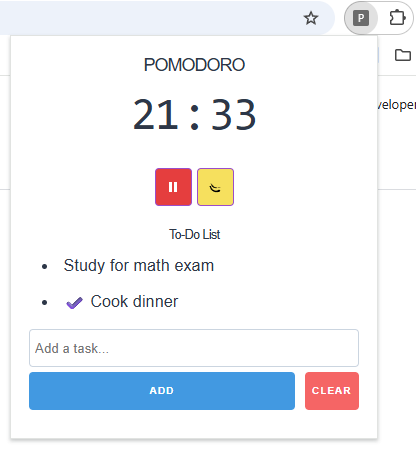

# Pomodoro Timer with To-Do List Chrome Extension

A lightweight Pomodoro timer Chrome extension with a built-in to-do list to help boost your productivity. The timer supports start, pause, and reset functionality, and the to-do list allows adding tasks, marking them complete with a checkmark and strikethrough, and clearing the list.

## Features

- Start/Pause Pomodoro timer with visual indicator (color and icon)  
- Create customizable to-do list and mark tasks as complete  
- Timer continues running in the background even when popup is closed  

## Installation

1. Clone or download this repository.
2. Open Chrome and go to `chrome://extensions/`
3. Enable **Developer mode** (top right corner).
4. Click **Load unpacked** and select the extension folder.
5. The extension icon will appear in the toolbar. Click it to open the Pomodoro timer popup.
